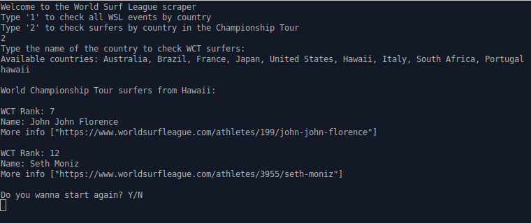

# WSL scraper

> This project is a web scraper of the World Surf League website to get text info about events and surfers, and display it on terminal.

- The program has 2 options of Scraping: Events and Surfers.
- In both options you can filter your scraping by country.

- For events you can check all WSL events around the year in the choosen country.
- - It will be specified by date, event name, location and tour type.

- For surfers you can check the top 35 surfers in the Championship Tour.
- - It will display the actual surfer rank, name and url link for more information.

## Built With

- Ruby
- Rspec

Gems:

- Nokogiri
- Open Uri

## Live Demo

[Live Demo Link](https://repl.it/@ThalesNeves/WSL-scraper#bin/main.rb)
- type 'ruby main.rb' in repl terminal to run the program

### Prerequisites

- Ruby
- Linux (if you don't use linux use the live demo above)
- Rspec

### Get started

- Clone this repository to your computer, or you download the zip file containing the repository files.
- Open the terminal in the respective folder.
- Type 'gem install bundler' in the terminal.
- Navigate to the folder where is the program is and type 'bundle install' to install the necessary gems to the program work.
- Type 'scraper' in the terminal to run the program.
- Follow the program instructions.
- Have Fun :surfer:

### Testing

- To run the tests in the program type 'rspec' in the terminal inside the program folder

## Author

👤 **Thales Neves**

- GitHub: [@thneves](https://github.com/thneves)
- LinkedIn: [@thales-neves10](https://www.linkedin.com/in/thales-neves10/)
- Twitter: [@tsneves11](https://twitter.com/tsneves11)

## Contributing

Contributions, issues, and feature requests are welcome!

Feel free to check the [issues page](https://github.com/thneves/WSL-scraper/issues).

## Support this project

Give a :star: if you like this project!

## Acknowledgements

[WSL](https://www.worldsurfleague.com/) World Surf League